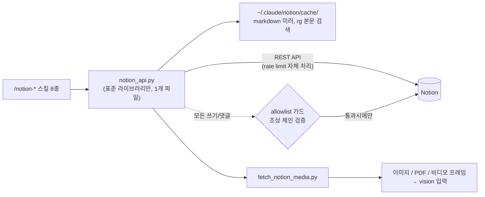

# n-claude-notion-skill

**Notion을 파일시스템처럼.**

[](LICENSE)
[](https://www.python.org/)
[](#스킬-구성)
[](https://developers.notion.com/)

Claude Code에서 Notion을 읽고, 검색하고, 쓰고, 고치는 스킬 모음.
공식 REST API 기반이라 MCP 커넥터 없이 돌고, 대화형 세션-서브에이전트-cron-워크플로 어디서든 같은 방식으로 동작한다.
의존성은 파이썬 표준 라이브러리뿐 - `pip install` 한 줄도 없다.

---

## 데모: 실제로 이렇게 보인다

**데이터베이스가 진짜 표로 읽힌다.** 행 나열이 아니라 속성 값까지.

```console
$ notion_api.py read <db-url> --filter '상태=대기' --sort '-우선순위'
# 🗃️ skill-test-db
**properties:** 상태(select), 우선순위(number), 마감일(date), 이름(title)

## Rows (1행)
| 이름 | 상태 | 우선순위 | 마감일 | id |
|---|---|---|---|---|
| 테스트 태스크 B | 대기 | 3 | 2026-08-20 | 3bd9c685-a827-81c5-... |
```

**보드에 태스크를 한 줄로 추가한다.** 속성은 `--prop`, 본문은 markdown 파일.

```console
$ notion_api.py write <db-url> '테스트 태스크 B' \
    --prop '상태=대기' --prop '우선순위=3' --prop '마감일=2026-08-20'
CREATED(row): 테스트 태스크 B
URL: https://app.notion.com/p/B-3bd9c685...
```

**댓글 스레드가 대화로 읽힌다.** 페이지 레벨과 블록 인라인 전부.

```console
$ notion_api.py comments <page-url> --all
[discussion 3bd9c685-...] (page 3bd9c685-...)
  2026-08-15 17:22 최철진: 스킬 테스트 댓글 1
  2026-08-15 17:22 최철진: 답글 테스트
[discussion 3bd9c685-...] (block 3bd9c685-...)
  2026-08-15 17:22 최철진: 블록 앵커 댓글 테스트
```

**이미지와 영상까지 읽는다.** 와이어프레임은 다운로드해서 vision으로 보고,
영상은 프레임을 샘플링해 contact sheet 한 장으로 본다. PDF 첨부는 통째로 읽는다.

---

## Quick start

**사람이 쓸 때:**

```bash
git clone https://github.com/FuJiGraphics/n-claude-notion-skill.git
cd n-claude-notion-skill
./install.sh          # ~/.claude/skills 에 심볼릭 링크 (레포 수정 = 즉시 반영)
```

이후 Claude Code에서 `/notion-login` - 브라우저가 열리고 Notion 피커에서
공유할 페이지를 고르면 끝. 그다음부터는 그냥 말하면 된다:

> "이 노션 기획서 요약해줘 https://notion.so/..."
> "작업 DB에서 진행중인 것만 보여줘"
> "회의 결정사항 노션에 정리해놔"

**에이전트/cron이 쓸 때:**

```bash
export NOTION_TOKEN=ntn_...   # internal integration 토큰 - 저장 없이 최우선 적용
python3 skills/notion-read/scripts/notion_api.py read <url>
```

브라우저 없는 환경도 같은 엔진, 같은 명령. 스킬과 CLI가 100% 동일한 코드를 탄다.

## Highlights

- **Claude 기본 도구와 1:1 대응** - Read/Grep/ls/Write/Edit 감각 그대로 Notion에 적용.
  새로 배울 개념이 없다.
- **DB 완전 대응** - 행 표 렌더, `--filter/--sort/--limit` 조회, `--prop` 행 생성,
  `db-create`/`db-prop` 스키마 관리, multi-source DB까지 (신버전 data_sources API).
- **코드 레벨 쓰기 가드** - 모든 쓰기는 조상 체인을 API로 검증해 allowlist 밖이면
  `WRITE_DENIED`. 모델이 실수해도 회사 문서가 오염될 수 없다.
- **미디어를 실제로 본다** - 서명 URL을 그냥 지나치지 않고 이미지 다운로드,
  비디오 프레임 샘플링, PDF 저장까지 해서 vision 입력으로 넘긴다.
- **본문 검색이 된다** - 공식 API는 제목만 검색하지만(API 제약), `sync`가 만드는
  로컬 캐시 위에서 ripgrep으로 본문을 뒤진다. 증분 갱신이라 재실행은 몇 초.
- **손실 불가 설계** - 블록 이동/복제는 복제 → 검증 → 원본 archive 순서.
  최악의 실패는 중복이지, 손실이 아니다.

## 스킬 구성

| Claude 도구 | 스킬 | 하는 일 |
|---|---|---|
| Read | `/notion-read` | 페이지/DB → markdown. 이미지-비디오-PDF까지. DB는 행 표 + 필터/정렬 |
| Grep | `/notion-grep` | 로컬 캐시 full-text + API 제목 검색 병합 |
| Glob/ls | `/notion-ls` | 워크스페이스 전체 트리 또는 특정 페이지 하위 목록 |
| Write | `/notion-write` | markdown → 새 페이지 / DB 행 생성, append, DB 생성/스키마 변경 |
| Edit | `/notion-edit` | 블록 특정 → 텍스트 교체 / move / duplicate / archive / restore |
| - | `/notion-comment` | 댓글 읽기(자유) / 게시(가드 + 게시 전 확인) |
| - | `/notion-login` `/notion-logout` | OAuth 또는 integration 토큰 등록 / 해제 |

## 아키텍처



읽기는 자유, 쓰기는 전부 가드를 통과해야 한다. 가드는 프롬프트가 아니라
코드라서 스킬이나 모델의 실수로 뚫리지 않는다.

## 쓰기 안전장치: 두 단계 허용목록

| 목록 | 파일 | 허용 범위 |
|---|---|---|
| 쓰기 | `~/.claude/notion/write_allowlist` | 페이지 생성, 블록 수정/삭제/이동, 속성, DB 스키마 (+ 댓글 자동 포함) |
| 댓글 전용 | `~/.claude/notion/comment_allowlist` | 댓글 게시만 - 본문은 계속 차단 |

한 줄에 페이지 id 하나. 등록한 페이지의 **하위 전체**가 열린다.
댓글은 API로 삭제가 불가능해서(Notion 제약) 별도 목록 + 게시 전 유저 확인을 강제한다.
회사 스펙에 리뷰 댓글은 달고 싶지만 본문 수정 권한은 주기 싫을 때 이 분리가 답이 된다.

```bash
notion_api.py allow '<내 작업공간 url>'            # 쓰기 허용 (유저 승인 후에만)
notion_api.py allow --comment '<팀 스펙 url>'      # 댓글만 허용
```

## markdown 쓰기 지원

헤딩 1~4 (`#>` = 토글 헤딩), 리스트 (들여쓰기 2칸 = 중첩, 깊이 무제한), `- [ ]` 투두,
`| md | 표 |`, `>` 인용, `> 💡 텍스트` = 콜아웃, 코드펜스, `---` 구분선,
단독 URL 줄 = 북마크, 인라인 굵게/기울임/취소선/코드/링크.

**2000자 넘는 텍스트는 자동 분할 전송한다 - 무음 절단이 없다.**
read가 뱉은 markdown을 write로 되넣어도 형태가 보존되는 왕복 대칭이 원칙.

## 인증

우선순위: `NOTION_TOKEN` 환경변수 → `~/.claude/notion/auth.json` → 레거시 `token` 파일.

- **OAuth (팀 배포용)**: 관리자가 public integration을 1회 등록
  (redirect URI `http://localhost:8917/callback`), client_id/secret을
  `~/.claude/notion/oauth_app.json`으로 배포. `/notion-login`이 브라우저를 열어
  페이지 피커로 공유 범위까지 한 번에 처리. 토큰 만료는 refresh로 자동 갱신.
- **Internal 토큰 (개인/즉시)**: notion.so/my-integrations 에서 생성 후
  `login --token <ntn_...>`. 읽을 페이지는 페이지 `⋯` → Connections 연결.

비밀 키는 전부 `~/.claude/notion/` (chmod 600) 로컬 저장 - 레포에는 절대 안 들어간다.

## CLI

엔진은 스킬 밖에서도 그대로 쓴다. 전체 명령표는 `notion_api.py` 상단 docstring에.

```bash
notion_api.py ls                                        # 워크스페이스 트리
notion_api.py read <url> --filter '상태=진행중' --sort '-우선순위'
notion_api.py write <db|page> '제목' --prop '상태=대기' --file body.md
notion_api.py db-create <parent> '작업 보드' --prop '상태:select:대기,진행중,완료'
notion_api.py comments <url> --all                      # 인라인 댓글까지
notion_api.py duplicate <page> --title '사본'           # 속성+본문 복제
notion_api.py sync 200                                  # grep용 미러 (증분)
```

## 개발 규칙

- **새 서브명령 추가/변경 시 같은 커밋에서** notion_api.py 상단 docstring의 명령표와
  해당 SKILL.md를 함께 갱신한다. 도구가 자기 능력을 정확히 광고하지 않으면
  그 위에 세운 판단이 통째로 틀린다 (실사례: move 미기재 → "이미지 이동 불가" 오보고).
- GET 응답을 생성 API 입력으로 재사용하지 않는다. 응답 스키마 ≠ 생성 스키마 -
  반드시 `CREATE_FIELDS` 화이트리스트를 거친다. 서버가 병합한 2000자 초과
  rich_text도 재분할해서 보낸다.
- 파괴 동작(archive/delete)은 항상 사본/결과 검증 후에만 실행한다.

## 알아둘 제약 (정직하게)

- 공식 `/v1/search`는 **제목만** 검색한다 (API 제약). 본문 검색은 로컬 캐시 + rg로 우회.
- **댓글은 API로 삭제 불가** - 잘못 게시하면 Notion UI에서 수동 제거뿐.
  그래서 게시 전 유저 확인이 절차에 박혀 있다.
- `status` 속성 타입은 API로 생성 불가 (UI 전용) - 새 DB 스키마엔 select를 쓴다.
- OAuth 개인 토큰은 `/v1/users` 목록 조회가 막혀 있다 (`USERS_RESTRICTED`) -
  people 속성은 user id 직접 지정으로 우회, internal 토큰이면 목록도 가능.
- 첨부파일 서명 URL은 약 1시간 만료 - fetch 직후 다운로드해야 한다.
- 한 페이지당 블록 3000개 상한 (초과 시 `TRUNCATED` 표시).
- rate limit 약 3req/s는 스크립트가 Retry-After로 자체 처리 - 그냥 좀 느려질 뿐.
- multi-source DB는 조회/쓰기/이동 전부 지원 - 소스가 여럿이면 `--source <이름|id>`.
- `synced_block`/`link_to_page`는 API로 복제 불가 - Notion UI에서만 이동 가능.

## 구조

```
skills/
├── notion-login/    SKILL.md
├── notion-logout/   SKILL.md
├── notion-read/     SKILL.md
│   └── scripts/
│       ├── notion_api.py         # 공용 엔진 - 전체 명령표는 파일 상단 docstring
│       └── fetch_notion_media.py # 이미지/PDF 다운로드 + 비디오 프레임/contact sheet
├── notion-grep/     SKILL.md
├── notion-ls/       SKILL.md
├── notion-write/    SKILL.md
├── notion-edit/     SKILL.md
└── notion-comment/  SKILL.md
```

## License

MIT. Notion은 Notion Labs, Inc.의 상표이며 이 프로젝트는 Notion과 무관한
비공식 도구다.
