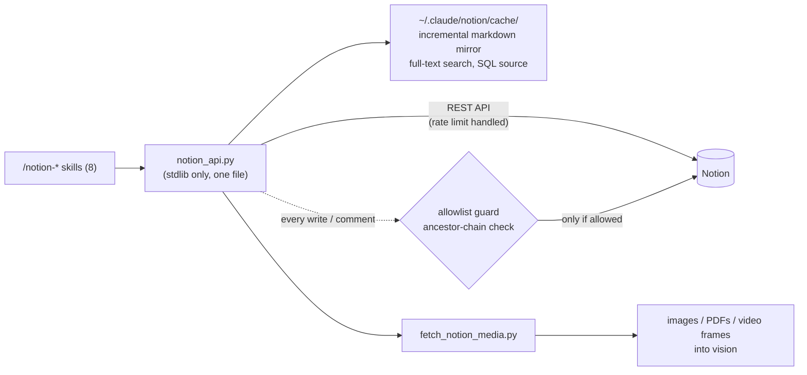

<div align="center">

# n-claude-notion-skill

**Notion as a filesystem for Claude Code.**

[](LICENSE)
[](https://www.python.org/)
[](#quick-start)
[](#skills)
[](https://developers.notion.com/)

Read, search, query, write, and review Notion from Claude Code - built on the
official REST API, so it runs identically in interactive sessions, subagents,
cron jobs, and workflows. No MCP connector, no pip installs, one Python file.

[Demos](#demos) | [Quick start](#quick-start) | [Highlights](#highlights) | [Skills](#skills) | [Architecture](#architecture) | [Write safety](#write-safety) | [CLI](#cli) | [Limits](#known-limits)

</div>

---

## Demos

[](assets/demo-read-db.svg)

**Databases read as tables, not link dumps.**
Schema, property values, filters, and sorting - `--filter '상태=대기' --sort '-우선순위'` -
with row ids ready for follow-up edits.

[](assets/demo-write-sql.svg)

**Rows in, answers out.**
`write --prop` adds a task to any board in one line. `sql` loads rows into an
in-memory SQLite table for joins, aggregates, and subqueries - read-only, no
plan restrictions.

[](assets/demo-guard.svg)

**Company docs cannot be touched by accident.**
Every write walks the target's ancestor chain and refuses anything outside a
local allowlist. The guard is code, not a prompt - a model mistake cannot get
through it.

---

## Quick start

**For humans:**

```bash
git clone https://github.com/FuJiGraphics/n-claude-notion-skill.git
cd n-claude-notion-skill
./install.sh          # symlinks into ~/.claude/skills - repo edits apply instantly
```

Then run `/notion-login` in Claude Code. A browser opens, you pick which pages
to share in Notion's own picker, done. From then on, just talk:

> "이 노션 기획서 요약해줘 https://notion.so/..."
> "작업 DB에서 진행중인 것만 보여줘"
> "회의 결정사항 노션에 정리해놔"

**For agents and cron:**

```bash
export NOTION_TOKEN=ntn_...   # internal integration token - highest priority, stored nowhere
python3 skills/notion-read/scripts/notion_api.py read <url>
```

Headless environments run the exact same engine with the exact same commands.

## Highlights

- **1:1 with Claude's native tools** - Read/Grep/ls/Write/Edit semantics mapped
  onto Notion. Nothing new to learn.
- **Full database support** - rows rendered as tables, `--filter/--sort/--limit`
  queries, `--prop` row creation, `db-create`/`db-prop` schema management,
  local **SQL** for joins and aggregates, multi-source databases via the
  modern data_sources API.
- **Code-level write guard** - two-tier allowlist (write / comment-only)
  verified against the ancestor chain on every mutation. See
  [Write safety](#write-safety).
- **Media actually gets seen** - images downloaded, videos frame-sampled into
  contact sheets, PDFs saved for page-by-page reading. Signed URLs never get
  skipped as "unreadable".
- **Body search that works** - the official API only searches titles; `search`
  merges that with full-text matches over a local incremental mirror, snippets
  included.
- **String-replace editing** - `edit-str --old/--new` gives Notion the Edit-tool
  feel; block-id surgery, move, duplicate, archive/restore cover the rest.
- **Loss-proof by construction** - block moves and duplicates copy first,
  verify, then archive the original. The worst possible failure is a
  duplicate, never a loss. Failed duplicates roll themselves back.

## Skills

| Claude tool | Skill | What it does |
|---|---|---|
| Read | `/notion-read` | Page/DB to markdown with breadcrumb path; images, video frames, PDFs; DB tables with filter/sort/SQL |
| Grep | `/notion-grep` | One command, two layers: API title search + full-text over the local cache |
| Glob/ls | `/notion-ls` | Whole workspace tree, or children of one page |
| Write | `/notion-write` | Markdown to new pages or DB rows (`--prop`); `db-create`/`db-prop` for schemas |
| Edit | `/notion-edit` | `edit-str` string replace; block edit/move; page duplicate/archive/restore |
| - | `/notion-comment` | Read threads anywhere; post under guard with mandatory pre-post confirmation |
| - | `/notion-login` `/notion-logout` | OAuth (browser picker) or integration token; full local credential removal |

## Architecture



Reads are free. Writes all pass through the guard. The guard is code, so
neither a skill bug nor a model mistake can bypass it.

## Write safety

| List | File | Grants |
|---|---|---|
| Write | `~/.claude/notion/write_allowlist` | Page creation, block edit/delete/move, properties, DB schemas (comments included) |
| Comment-only | `~/.claude/notion/comment_allowlist` | Posting comments only - content stays locked |

One page id per line; everything **under** a listed page is covered.
Comments get their own tier because the API cannot delete a comment (Notion
limitation) - review-commenting on a team spec should not require handing out
content-edit rights.

```bash
notion_api.py allow '<my-workspace-url>'          # write access (only after explicit user approval)
notion_api.py allow --comment '<team-spec-url>'   # comments only
```

## Markdown support

Headings 1-4 (`#>` = toggle heading), lists (2-space indent nests, unlimited
depth), `- [ ]` todos, `| md | tables |`, `>` quotes, `> 💡 text` = callout,
code fences, `---` dividers, a bare URL line = bookmark, inline
bold/italic/strikethrough/code/links.

**Text over 2000 chars per block is chunked automatically - nothing is ever
silently truncated.** Round-trip symmetry is a design rule: markdown produced
by `read` feeds back through `write` without degrading.

## Authentication

Priority: `NOTION_TOKEN` env var, then `~/.claude/notion/auth.json`, then the
legacy `token` file.

- **OAuth (team rollout)**: an admin registers one public integration
  (redirect URI `http://localhost:8917/callback`) and distributes
  `client_id`/`client_secret` as `~/.claude/notion/oauth_app.json`.
  `/notion-login` opens the browser, Notion's picker sets the sharing scope,
  tokens auto-refresh on expiry.
- **Internal token (personal, instant)**: create at notion.so/my-integrations,
  then `login --token <ntn_...>`. Connect pages via the page `⋯` menu.

All secrets live in `~/.claude/notion/` (chmod 600), never in any repo.

## CLI

The engine works standalone. The full command table lives in the docstring at
the top of `notion_api.py`.

```bash
notion_api.py ls                                             # workspace tree
notion_api.py read <url> --filter '상태=진행중' --sort '-우선순위'
notion_api.py sql 'SELECT 상태, COUNT(*) FROM t GROUP BY 상태' --db <db-url>
notion_api.py write <db|page> '제목' --prop '상태=대기' --file body.md
notion_api.py edit-str <url> --old 'before' --new 'after'
notion_api.py comments <url> --all                           # inline threads included
notion_api.py duplicate <page> --title 'copy'                # props + content, rollback on failure
notion_api.py sync 200                                       # incremental grep mirror
```

## Development rules

- **Any new or changed subcommand updates, in the same commit,** the command
  table in the `notion_api.py` docstring and the relevant SKILL.md. A tool that
  misadvertises its abilities poisons every decision built on top of it
  (real incident: `move` went undocumented, so the model reported "images
  can't be moved").
- Never feed GET responses back into create APIs. Response schema != create
  schema - everything passes the `CREATE_FIELDS` whitelist, and server-merged
  rich_text over 2000 chars gets re-chunked.
- Destructive actions (archive/delete) run only after the copy or result is
  verified.

## Known limits

Honest list - these are API or product constraints, not TODOs:

- Official `/v1/search` matches **titles only**. Body search runs over the
  local mirror, so its freshness is the mirror's freshness (`sync` is
  incremental and cheap to re-run).
- **Comments cannot be deleted via the API.** A bad post stays until removed
  by hand in the Notion UI - which is why posting requires explicit user
  confirmation and its own allowlist tier.
- `status` properties cannot be created via the API (Notion UI only) - use
  `select` in new schemas.
- OAuth personal access tokens cannot list workspace users
  (`USERS_RESTRICTED`); assign people properties by user id, or use an
  internal integration token.
- Signed file URLs expire in about an hour - media downloads happen
  immediately after fetch.
- 3000 blocks per page read cap (marked `TRUNCATED` when hit); ~3 req/s rate
  limit handled internally with Retry-After.
- `synced_block` / `link_to_page` cannot be copied through the API - they move
  only in the Notion UI.
- Notion-internal features without public endpoints stay out of scope:
  semantic search, resolved-comment history, views, folders, teamspaces,
  meeting-note transcripts.

## Layout

```
skills/
├── notion-login/    SKILL.md
├── notion-logout/   SKILL.md
├── notion-read/     SKILL.md
│   └── scripts/
│       ├── notion_api.py         # the whole engine - command table in its docstring
│       └── fetch_notion_media.py # image/PDF downloads, video frames + contact sheet
├── notion-grep/     SKILL.md
├── notion-ls/       SKILL.md
├── notion-write/    SKILL.md
├── notion-edit/     SKILL.md
└── notion-comment/  SKILL.md
assets/               # animated SVG demos used above
```

## Disclaimer

Notion is a trademark of Notion Labs, Inc. This is an unofficial tool, not
affiliated with or endorsed by Notion Labs or Anthropic.

## License

[MIT](LICENSE)
